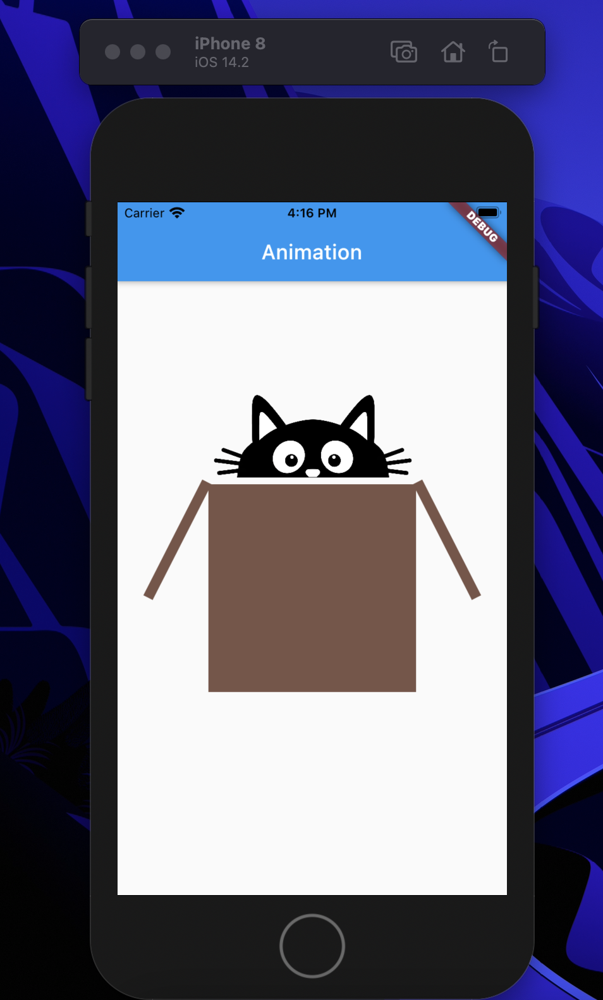

# 📱 Example-flutter-app 

## 🎬 **How to run** 🎬
```shell
> git clone https://github.com/voratham/example-flutter-app.git
> cd example-flutter-app
> cd project_target
> open -a simulator # start ios simulator
> flutter run
```

## **Table of content**
- **PicsApp** is list image widget and used dio package request to example api
- **LoginStatefulApp** is example interact form login 
- **LoginBlocApp** is example used stream bloc pattern with stream,sink and used RxDart package manage form stage
- **AnimationApp** is widget with animation builder

    
